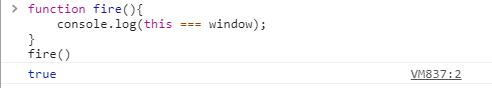
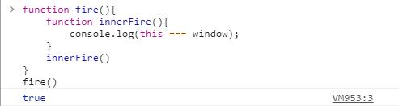
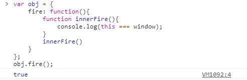
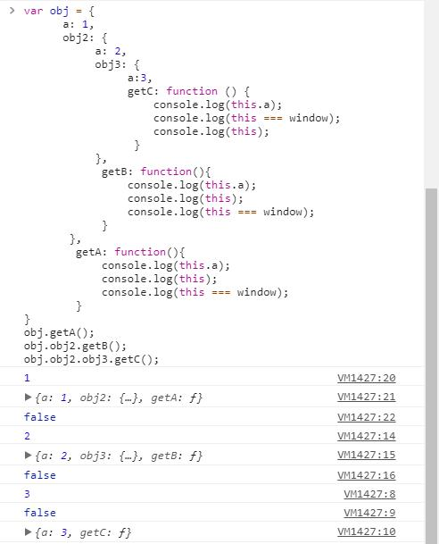
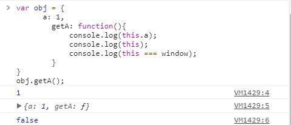
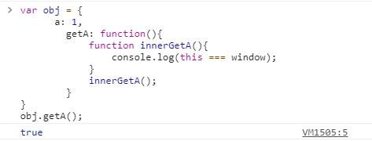
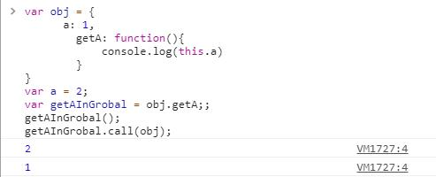
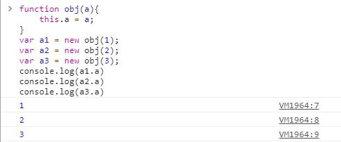

函数中 _this_ 的绑定形式
================
>
一、this的默认绑定。——绑定到全局的window对象。

>当一个函数没有明确的调用对象的时候，也就是单纯作为独立函数调用的时候，将对函数的this使用默认绑定：绑定到全局的window对象。

>栗子：

>
二、this的隐式绑定。——  （？没懂TAG）
>栗子：（疑问）

>（隐式绑定存在 this绑定丢失的问题。）
>
三、this的显式绑定。——call和bind方法

>1、call的基本用法：fn.call(object)。object参数是你希望函数的this所绑定的对象。

>>作用：

>>>    1）即可调用函数fn。
       2）调用这个函数的时候this指向object对象。

2、call和bind的区别。

>> call是立即执行函数fn。bind不执行函数，只返回一个可供执行的函数。
>
四、new绑定。**——创建一个新的对象，并且将构造函数的this指向所创建的新对象。**

